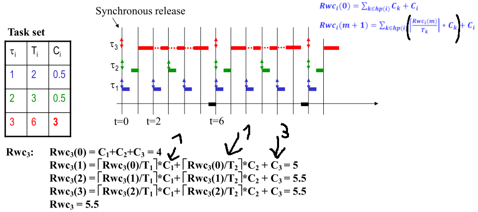

<!-- markdownlint-disable MD024 MD025 -->

# Deadlines

## Time

- **Relative:**
  - relativa à task activation;
  - executar dentro de uma duração max.
- **Absolute:**
  - ponto absoluto no tempo;
  - finish tem que ser menor que o tempo max.

## Utility

- **Soft** - Perde valor a partir da deadline, mas não perde tudo logo (e.g.
  video-call);
- **Firm** - Valor fica com 0 utilidade apõs a deadline (e.g. pre-paid services
  validation);
- **Hard** - Time constraint que quando não é met pode ter resultados
  catastroficos (e.g. critical control).

### System with time constraints

- Soft Real-Time - Só há **firm** ou **soft** time constraints;
- Hard Real-Time - Há pelo menos 1 **hard** time constraint. São os
  **safety-critical** systems.

## Logical control

Program control flow, effective sequence of operations to be executed;

## Temporal control

Control of the **execution instants** of the program operations:

- Activations;
- Verification of time constraints.

### Triggering tasks

- By time - (TT) time-triggered systems:
  - A execução é triggered por um sinal baseado na progressão do tempo (e.g.
    periodic interrupt);
  - Tipicamente usado em automatic control;
  - CPU utilization constant;
  - Well defined worst-case situation.
- By events (ER) event-triggered systems:
  - A execução é triggered por um async control signal gerado por uma mudança do
    estado do sistema (e.g. external interrupt);
  - Tipicamente usado para monitorizar sporadic conditions in the systems state
    (e.g. alarms or async service requests);
  - CPU utilization é variável;
  - Poorly defined worst-case situation.

# Pre-Scheduling

## Tasks

- **Periodic** - instance activated every n time (can have offset on first
  activation) - Pode-se fazer começar desfazadas para n interferirem;

  

- **Sporadic** - minimal time between consecutive activations - worst-case
  parece **periodic** mas não sabemos quando começa (não conseguimos garantir
  que não interferem);

  

- **Aperiodic** - **Can't bound worst case**. Can only be characterized
  stochastically.

  

## Preemption

- Task is **temporarily suspended** for the execution of another with higher
  priority;
- **Full preemption** - all tasks can be preempted in any point of their
  execution (independent tasks);
- **Shared resources** podem cause tasks with **dependencies** => restringem o
  level de preemptability de uma task.

  

# Off-line Scheduling

## Static cyclic scheduling

- Off-line scheduling;
- **Macro-cycle (MC)** - tabela composta de micro-cycles;
  - $MC = LCM(T_i)$
- **Micro-cycles (uC)** - divisões da tabela com duração fixa. São triggered por
  um timer;
  - $uC = GCD(T_i)$
- **Pros:** barato, simples;
- **Cons:**

  - Tabelas podem ser grandes;
  - Missed deadline pode causar dominó effect;
  - Pode ser necessário partir uma task em várias;
  - Não dá para sporadic tasks.

  

# On-line scheduling with fixed priorities - $O(n)$

- Schedule é feito com o sistema on-line;
- Baseado na **priority**:
  - Static parameter de cada task;
  - Usa um [priority assigment agorithm](#assigning-prios).
- Se preemption é allowed => task atualmente running pode ser interrompida se
  chegar uma task com mais priority à cabeça da (ready) queue;
- **Pros:**
  - Easily scalable (scheduler considera qualquer task que fica ready a qualquer
    altura);
  - Easily accomodates sporadic tasks;
  - Deterministic behavior under overloads => só afeta tasks com prio mais baixa
    que a do overload.
- **Cons:**
  - More complex than the cyclic;
  - Higher run-time overhead: scheduler + dispatcher;
  - Overloads at high prio levels podem bloquear todo o sistema.

## Assigning prios

- **RM - Rate Monotonic:**
  - Inversamente proportional ao período;
  - Ótimo para todos os fixed priority criteria.
- **DM - Deadline Monotonic:**
  - Inversamente proportional à deadline;
  - Ótimo para $D \le T$
- **Proportional à importância das tasks:**
  - Non optimal;
  - Pode causar redução da eficiência.

**Note:** usar **DM** em vez de **RM** se $D < T$.

## Verifying schedulability

2 tipos de teste:

- CPU utilization;
- Response time.

### RM - Rate Monotonic scheduling ($D = T$)

- Utilization-based test;
- Considerar:
  - Allowed preemption;
  - n independent tasks;
  - $D = T$
- **Least Upper Bound** of Liu&Layland:

  - $U(n) \le LUB \Leftrightarrow \sum^{n} _ {i=1} \frac{C_i}{T_i} \le n * (2^{\frac{1}{n}} - 1)$
  - $U(n) > 1$ => non schedulable set (overload);
  - $U(n) \le LUB$ => schedulable set;
  - $1 \ge U(n) \ge LUB$ => indetermined case.

    

- **Hyperbolic Bound**: também garante 1 instance por período.

### DM - Deadline Monotonic scheduling ($D \le T$)

- When a task has a long period but needs to be served quickly after release
  then the RM criterion is non-optimal:
  - Its better to use their deadline as criterion.
- Considerando $T = D$ (diminui período), podemos usar utilization-based tests:
  - This is pessimistic;
  - Se funciona no pessimista => funciona no real.

### Special case: Harmonic periods

- Se os periods forem harmónicos, verificamos se $U(n) <= 100%$ em vez de ver a
  LUB;
- **Períodos harmónicos** - sáo todos múltiplos entre si;
- No caso do DM, olhámos para as deadlines em vez dos periods: a deadline é o
  period.

### Response time analysis

- Condições para o teste ser necessário e suficiente:
  - Preemption;
  - Synchronous release;
  - Independence;
  - **Note:** tem de ser adaptado quando non-preemption ou non-independence
    (shared resources, and precedences).
- **Worst-case response time** - largest time interval since a task is released
  until it finishes;
  - $Rwc_i = max_k(f_{i,k} - a_{i, k})$
- **Response time-based sched test** - $\forall_i Rwc_i <= D_i$ => **schedulable
  set**;
- O worst-case acontece quando uma task é released em conjunto com todas com
  maior prio => **critical instant**:
  - **Synchronous release** neste caso;
- A **highest prio não sofre interferências**;
  - O seu response time é o tempo de execução.
- $\forall_i Rwc_i = I_i + C_i$:

  - $I_i$ - interference caused by the execution of tasks with higher priority;
  - $I_i = \sum_{k \in hp(i)} * \lceil \frac{Rwc_i}{T_k} \rceil * C_k$
  - $\lceil \frac{Rwc_i}{T_k} \rceil$ - number of times that a higher priority
    task, k, is released in the interval $Rwc_i$.

    

# On-line scheduling with dynamic priorities - $O(n * log(n))$

- Priorities são dinámicas => só conhecidas pelo scheduler em runtime;
- Ready tasks queue é sorted por decreasing priorities sempre que há mudança nas
  priorities relativas entre tasks;
- A primeira a correr é a task com **highest instantaneous priority**.
- **Pros:**
  - Easily scalable - scheduler considera apenas tasks que ficam ready at any
    time;
  - Easily accommodates sporadic tasks (same reason).
- **Cons:**
  - Mais complexo que cyclic executive;
  - Higher run-time overhead (sorting da queue);
  - Instability with overloads => impossivel saber à priori quais tasks will
    meet their deadlines.

## Assigning prios

- **EDF - Earliest Deadline First:**
  - Inversely proportional to the time to the deadline:
  - Optimal with respect to dynamic priorities criteria.
- **LSF (LLF) - Least Slack First:**
  - Inversely proportional to the slack or laxity:
  - Optimal with respect to dynamic priorities criteria.
- **FCFS - First Come First Served:**
  - Inversely proportional to the waiting time:
  - Non optimal. May impose long blocking.

## Verifying schedulability

3 tests:

- Based on CPU utilization;
- Based on CPU demand;
- Based on response time.

### EDF Scheduling - CPU utilization

- With preemption and _n_ independent tasks;
- $D = T$
  - $U = \sum_{i=1}^n \frac{C_i}{T_i} \le 1$ <=> schedulable set;
  - **Offsets are irrelevant**;
  - Permite usar 100% do CPU garantindo time constraints.
- $D < T$
  - $U^ * = \sum_{i=1}^n \frac{C_i}{D_i} \le 1$ => schedulable set;
  - **Aqui o $U^{ * }$ é density** (not utilization).
- Arbitrary D
  - $\sum_{i=1}^n \frac{C_i}{min(D_i, T_i)} \le 1$ => schedulable set.

- EDF consegue dar exploit a toda a flexibilidade nas tasks (incluindo highest
  priority);
- Faz menos premptions;
- Worst case não ocorre no **synchronous release**;
- **Notion of fairness** - EDF é intrinsicamente mais fair que RM no sentido que
  todas as tasks ganham priority quando se aproximam da deadline
  (independentement do período ou outro parámetro estático):
  - Facilitates meeting deadlines;
  - Avoids preemptions quando tasks se aproximam das deadlines;
  - Uses the _slack_ of the tasks of faster activation but which deadline is
    later => Fast tasks têm jitter;

### EDF Scheduling - CPU demand analysis

- Para $D <= T$, o maior intervalo de consecutive CPU load (i.e. without
  interruption) still corresponds to the **synchronous release**;
- **Synchronous busy period** - período que dura $L$ time units em que CPU tá
  sempre busy (começa no **synchronous release**);
- Calcular $L$. Dá o primeiro momento em que o CPU está livre:
  - $L(0) = \sum_i C_i$
  - $L(m + 1) = \sum_i \lceil \frac{L(m)}{T_i} \rceil * C_i$
- Sabendo _L_, temos de garantir a _load condition_:
  - $h(t) \le t$, $\forall_{t \in [0, L[}$ <=> schedulable set (synchronous
    release)
  - $h(t) = \sum_{D_i <= t}(1 + \lfloor \frac{t - D_i}{T_i} \rfloor) * C_i$, é a
    load function
- Computar $h(t)$ para o intervalo é impossível:
  - Basta computar para os pontos onde a funçao varia => **deadlines**;
- **Note:** there are other intervals possibly shorter than _L_.

### EDF Scheduling - Response time analysis

- Can't know a priori which is the task activation that suffers the maximal
  interference;
- Known that the worst-case response time occurs within the **synchronous busy
  period** ($L$);
  - Verificamos todas as ativações em $L$
- Podemos obter uma upper-bound aproximada para o response-time (as long as
  $U <= 1$):
  - $\forall_i Rwc_i \le T_i * U$
  - Pessimistic.

### LSF (LLF) Scheduling

- Optimal (como o EDF);
- Quando slack baixa => priority sobe;
- Priority das ready tasks sobe conforme o tempo passa;
- Priority da task que está a executar mantém-se constante;
  - No EDF tanto as priorities das ready como das executing aumenta de forma
    igual com o passar do tempo.
- Scheduled task may change over and over in an oscillatory behavior:
  - Causa maior número de preemptions que o EDF (higher overhead).
- **No real advantages em relação ao EDF**.

### FCFS Scheduling

- Non-optimal;
- _age of an instance_ sobe => priority sobe;
- Priority of ready and executing tasks aumenta de forma igual conforme o tempo
  pass (como no EDF);
- Quando uma nova task é ativada é sempre dada uma prioridade mas baixa que
  todas as outras;
- Não tem preemptions (lower overhead/easier implementation);

# Shared resources

- **Priority inversion** - When tasks can access shared resources in **exclusive
  mode**, tasks can be blocked by lower priority tasks;
- Techniques should allow bouding the period of priority inversion (quantificar
  o worst-case blocking);
- Quando blocking está bounded (B), o mais comum é considerar que a task tem uma
  maior tempo de execução (C + B).

  

## Techniques to control access to shared resources

- **Global** (affect all tasks):
  - **Interrupt disabling**;
  - **Preemption disabling**;
  - Task so pode ser **blocked once** pela duração da **longer critical region**
    de entre as tasks de lower priority (or shorter relative deadline for EDF);
  - Blocked mesmo que nenhum resource seja usado.
- **Reduced scope** (affect just a subset of tasks):
  - **Locks/atomic flags (e.g. mutexes)**;
  - **Semaphores**;
  - More efficient, but needs to be implemented at kernel level (harder);
  - Blocking duration dependent on the **specific protocol** used to manage the
    **semaphores**;
  - Protocol should allow **avoiding**:
    - Undetermined blocking;
    - Chained blocking;
    - Deadlocks;

## PIP - Priority Inheritance Protocol

- The blocking task (**lower prio**) **inherits the priority** of the blocked
  task (**higher prio**);
- **Limits the duration of the blocking periods** by avoiding that tasks with
  intermediate priority execute while the blocking task (lower prio) is actually
  blocking a higher priority task.

  

- In the **absence of nested resource accesses**:

  - Each task **can only block another task once**;
  - Each task **can only be blocked once in each semaphore**.

    

- **Pros:**
  - Relatively easy to implement. Extra field no TCB (a inherited priority);
  - It is transparent for the programmer (cada task só usa local info);
- **Cons:**

  - Sofre de **chained blocking** => o blocking é a soma de vários sems;
  - Não é **deadlock-free**.

    

## PCP - Priority Ceiling Protocol

- Extensão ao PIP:
  - Adiciona regra para controlar o **accesso a semaphores livres**;
  - Assegura que todos os semaphores necessários estão livres.
- **Priority ceiling** - cada semaphore tem o value da highest prio entre as
  tasks que o usam;
- Uma task só pode **acquirir um sem que está free** e a **priority é maior que
  o ceilings que todos os sems locked**:
  - First check => quer dizer que não usa aqueles sems;
  - Second check => só interessa os locked pk são os únicos que podem dar block.
- **Ceiling block** - Só executamos quando é garantido poder executar até ao fim
  sem ser blocked.

- **Each task can only be blocked once**:
  - Enquanto espera pelos recursos todos que precisa;
- To bound the **blocking time** (B), a task can be blocked by:
  - Any other task with lower priority that uses the same semaphore;
  - Any other task that uses a semaphore which ceiling is at least equal to its
    priority.

- **Pros:**
  - Shorter blocking than PIP;
  - Free from chained blocking => **o block não é a soma de vários sems**;
  - Deadlock-free.
- **Cons:**
  - Harder to implement:
    - no TCB precisa de 1 field para a inherited priority e outro para o
      semaphore em que a task está blocked => facilitate inheritance
      transitivity;
    - Semaphore precisa de guardar ceiling e id da task que o ta a usar =>
      facilitate inheritance.
  - Not transparent to the programmer: needs to code the ceiling with are not
    local to the tasks.

**Note:** para funcionar em EDF. A blocking task inherits the deadline of the
blocked tasks and the semaphore ceiling use the relative deadlines (preemption
level).

## SRP - Stack Resource Policy

- Similar to PCP but with a rule on the actual **execution release**;
- **Preemption level ($\pi$)** - capacidade de uma task de causar preempção a
  outra (calculado usando relative deadline);
- **Não precisa de uma blocking state** => tasks que seriam blocked não começam;
  - Uma task só pode começar se o seu $\pi$ for maior que o da running task e
    maior que os ceiling de todos os locked semaphores (**system ceiling**);
  - Só começa quando todos os needed resources estão free.
- **Blocking upper bound** (B) is similar to PCP, but occurs in a different
  moment (**task release**).

- Each task can be blocked just once by any task with **lower preemption level**
  that uses a semaphore whose **ceiling is at least equal to its own preemption
  level**.

- **Pros:**
  - Shorter blockings than PIP;
  - Free from chained blocking;
  - Deadlock-free;
  - Less preemptions than PCP;
  - Intrinsically adapted to **fixed or dynamic priorities** or resources with
    multiple units;
  - Como não há blocking durante a task execution:
    - tasks **do not need an individual stack**;
- **Cons:**
  - Harder to implement:
    - Preemption test is more complex;
    - Needs keeping the system ceiling;
    - Worse if using resources with multiple units.
  - Not transparent to the programer (semaphore ceilings).

# Scheduling aperiodic tasks

- Limit interference over periodic/sporadic tasks;
- Provide best Quality-of-Service possible;
- **Note:** consider both sporadic and periodic as _periodic_.

## Execution in the background

- Dar **lowest priority** às **aperiodic** tasks `=>` worst-case bound a 0
  interference;
- **Pros:**
  - Easy to implement;
  - Does not interfere with the periodic subsystem;
- **Cons:**
  - Worst QoS: aperiodic tasks can suffer **large service delays**;
  - Depends on the periodic load (can be computed considering aperiodic tasks as
    the lowest priority ones).
- Mau para RT aperiodic tasks (e.g. alarms);
- Bom para non-RT aperiodic tasks (e.g. file transferes).

  

## Using servers to run aperiodic tasks

- Improve the service;
- **Periodic server** - uma **task periodic especial** que executa as tasks
  aperiodic ativas:
  - Caracterizado pelo period $T_s$ e capacity $C_s$;
  - Pode ser inserido com o **required priority level** para obter o desired
    service level.

### Worst-case service to aperiodic requests (tasks)

- Similar para todos os servers que podem ser modelados como periodic tasks
  under full load;
- Server:

  - É uma periodic task;
  - Sofre **maximum jitter** at the instant of the aperiodic request;
  - Sofre **maximum interference delay** in all subsequent instances.

  

- Se tiver mais que 1 aperiodic task, usa-se $\sum_{k=1}^i Ca_k$ em vez de
  $Ca_i$;
- O $1 +$ desaparece se a task for a highest priority:
  - Já não existe a interference delay que afeta as subsequent instances.

# Task servers

## Fixed priority

### Polling server - PS

- Quando começa a correr, verifica se há tasks para ready:
  - Se não tiver, dá **yield** (não usa a capacidade que ainda tem nesse
    período).
- Se alguém ficar ready depois do **yield**, vai ter de esperar pelo próximo
  período.
- **Pros:**
  - Simple implementation (single queue + controlo da capacity usado até agora);
  - **Average response time** improved em relação à background execution, porque
    é possível executar aperiodic tasks com maior priority
- **Cons:**
  - Ainda há intervalos de unavailability (correspondem ao **server period**).
- **Impacto na schedulability** (no periodic subsystem) é equivalent a virtual
  periodic task correspondente (análise usa os métodos do costume).

### Deferrable server - DS

- Mantém a **unused capacity** até ao final do período:
  - Aperiodic task pode obter immediate service se o server estiver ativo e
    ainda tiver capacity neste período.
- Server dá full replish à capacity em cada período (**não acumula**).
- **Não segue as rules de periodic tasks:**
  - Não dá para aplicar schedulability tests a não ser que o server seja o
    **lowest priority** (o **mesmo que correr no background**).
- **Pros:**
  - Complexity similar a PS;
  - **Average response time** de aperiodic requests é **improved** em relação ao
    PS pk é possível usar a capacity do server mesmo depois dos intervalos
    assigned pelo periodic scheduler;
  - Isto elimina os **unavailability periods** do PS;
- **Cons:**
  - Server tem **negative impact** na schedulability (do periodic subsystem);

### Sporadic server - SS

- Não é visto como periodic, mas sim como **sporadic** (execução pode começar
  whenever);
- **Não penaliza schedulalibility** (à custa de slightly longer response time);
- If the **execution of the server is deferred** => **capacity replenishment
  defered**:

  - Enforces **server bandwidth**;

  

- **Pros:**
  - **Average response time** to the aperiodic requests is similar to that of a
    DS;
  - **Impacto** na schedulalibility do periodic subsystem é similar ao de uma
    normal periodic task (similar a PS por causa do bandwidth enforcement).
- **Cons:**
  - Higher implementation complexity than DS (structure with the replenishment
    instants and the amounts to replenish);
  - Requer OS implementation.

## Dynamic priorities

Dynamic priorities (para EDF systems).

### Total bandwidth server - TBS

- Usa CPU bandwidth independentemente do arrival pattern:
  - Dá bound ao impacto dos aperiodic requests no periodic subsystem.
- Deadline assigned ($d_k$) ao new request ($k$) que chega no instante
  ($r_k$):  
  $d_k = max(r_k, d_{k-1}) + \frac{C_k}{U_S}$

  

- **Pros:**
  - Implementação simples;
  - Basta calcular uma deadline para cada request que chega e inseri-lo na ready
    task queue (junto das periodic tasks);
  - **Average response time** to aperiodic requests é **shorter** que a dynamic
    priorities versions dos servers anteriores;
  - O **impacto** da schedulalibility do periodic subsystem é similar que o da
    periodic task com a **mesma bandwidth** que o server;
- **Cons:**
  - **Vulnerável a overload** (task demora mais do que disse que ia demorar);
  - No control over the actual execution time (no capacity control).
- $U_p + U_S \le 1$.

### Constant bandwidth server - CBS

- Designed to solve robustness problem of the TBS => enforcing **bandwidth
  isolation**;
- **Capacity management scheme** - $(Q_S, T_S)$;
- Deadline assigned ($d_k$) ao new request ($k$) que chega no instante ($r_k$),
  cuja remaining server capacity no instant é $C_S(r_k)$:
  - if $r_k + C_S(r_k)/U_S < d_{k-1}$ => $d_k = d_{k-1}$
  - else => $d_k = r_k + T_S$ and $C_S(r_k) = Q_S$
- Quando a server capacity é exhausted ($C_S = 0$), é imediatamente replenished,
  mas o $d_k$ leva post pont (enforce server bandwidth):
  - $d_k = d_k + T_S$
  - $C_S = Q_S$
  - Corresponde a dar lower à priority.

- **Pros:**
  - Só há 1 **ready queue** para tasks (tanto periodics como aperiodics);
  - Queue managed by deadlines;
  - **Average response time** to aperiodic requests é **similar** ao do TBS;
  - O **impacto** da schedulalibility do periodic subsystem é similar que o da
    periodic task com a **mesma bandwidth** que o server.
- **Cons:**
  - Higher implementation complexity than TBS por causa do capacity management;
- $U_p + U_S \le 1$
- Qualquer task schedulable em EDF é schedulable em CBS com $Q_S = C_i$ and
  $T_s = T_i$

CBS can be used for:

- **Protecting a system of tasks overruns**;
- Guaranteeing a **minimal service** to soft real-time tasks;
- **Reserve bandwidth** for any activity.

# POSIX RT

## Scheduling algorithms

All algorithms are compatible and may co-exist.

- `SCHED_OTHER` - Not Fixed Priotity => not good for RT;
- `SCHED_FIFO` - FIFO for threads/processes of the same priority;
- `SCHED_RR` - Like FIFO, but with a max. quantum execution time;
- `SCHED_SS` - Sporadic Server => good for aperiodic tasks.

## Contention scopes

Applied per thread or per process (may co-exist):

- **System contention scope** - All threads in the system compete, regardless of
  the process to which they belong;
- **Process contention scope** - The scheduler workds at 2 levels:
  - First - escolhe process de acordo com a prioridade;
  - Second - chooses the highest priority thread of that process.
- **Mixed contention scopes** - Some threads have a _system_ scope, and other
  threads have a _process_ scope.

## Mutual Exclusion Synchronisation - Mutex

- Protecting against Unbounded Priority Inversion:
  - No protection -- `PTHREAD_PRIO_NONE`;
  - Immediate priority ceiling -- `PTHREAD_PRIO_PROTECT` -- good for static
    systems where it is possible to determine a priority ceiling;
  - Priotity inheritance -- `PTHREAD_PRIO_INHERIT` -- useful in dynamic systems
    where it is impossible to assign a ceiling.
- Implementado como uma variavel:
  - Todos os processos que acedem a um mutex têm de ter acesso à var do mutex;
  - Using mutexes between processes requires the mutex var to be placed in
    shared memory.
