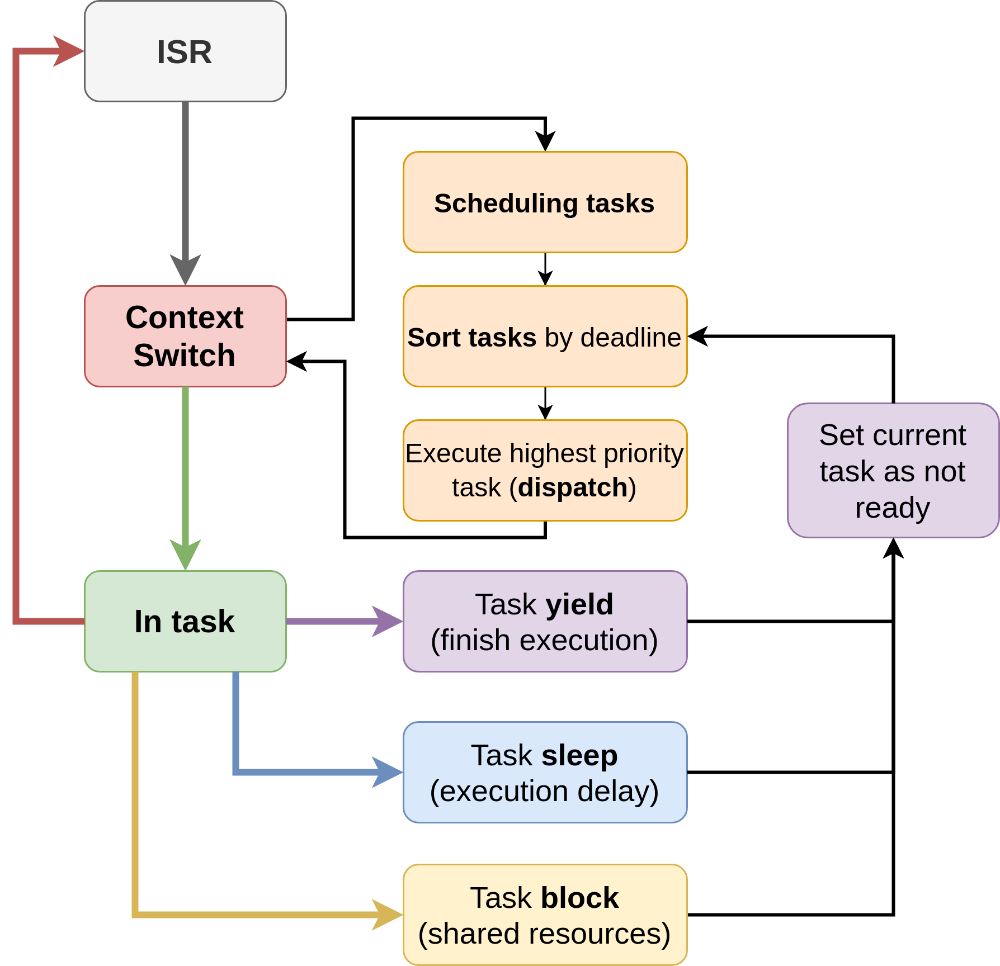

# Checkpoint of the project status

- **Group:** C
- **Project title:** uKernel

## Project description

A tick-based micro kernel for the Arduino Uno. The kernel supports preemption,
sleeping, and mutexes with priority inheritance.

## Project status

We consider the project to be finished, with the exception of the report.

We currently have a micro-kernel that supports **preemption**, task
**sleeping**, and **mutexes** with **priority inheritance**, as was planned.
We've also implemented other things like: optional stack canaries, optional
trace functions, state assertions, and a failure state.

## Project architecture

